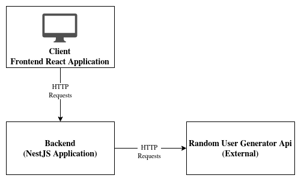

# Colab Desafio (Sistema de Listagem de Usuários)
Repositório referente ao desafio do processo seletivo da Colab sendo um projeto de aplicação web desenvolvido com React para o frontend e NestJS para o backend

## Desafio
criar uma aplicação web que consuma a API [Random User Generator](https://randomuser.me/) para exibir uma lista de usuários e os detalhes de cada usuário.

## Requisitos
- A aplicação deve ser escrita em TypeScript.
- O frontend deve ser desenvolvido usando React.
- O back-end deve estar separado, porém no mesmo repo, pode ser utilizado qualquer framework node.js
- O backend deve consumir a API Random User Generator para obter os dados dos usuários e não o front diretamente.
- Deve haver uma página de listagem de usuários que exiba pelo menos o nome de cada usuário.
- Ao clicar em um usuário da lista, deve ser exibida uma página de detalhes que mostra informações mais detalhadas sobre o usuário selecionado.
- A interface do usuário deve ser atraente e amigável, utilize qualquer framework de UI ou DS que você conheça.
- Os commits no repositório Git devem ser organizados e significativos.
- O README.md deve explicar as decisões de arquitetura, paradigmas e outras escolhas importantes feitas durante o desenvolvimento da aplicação.

## Design do sistema
- **frontend**: Contém o código do frontend em React, incluindo componentes, páginas e serviços para interagir com o backend e exibir os dados dos usuários.
- **backend**: Contém o código do backend em NestJS, incluindo todo o necessário para fornecer uma API que busca dados de usuários da API Random User Generator.



## Iniciando a Aplicação
Para iniciar o backend da aplicação utilize os seguintes comandos:
```
npm install
npm run start
```
Já para iniciar o frontend da aplicação utilize os comandos:
```
npm install
npm start
```
